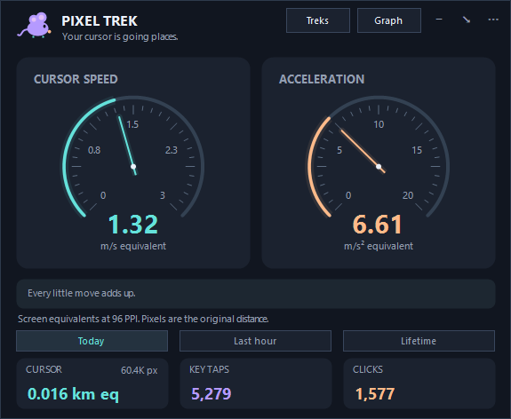
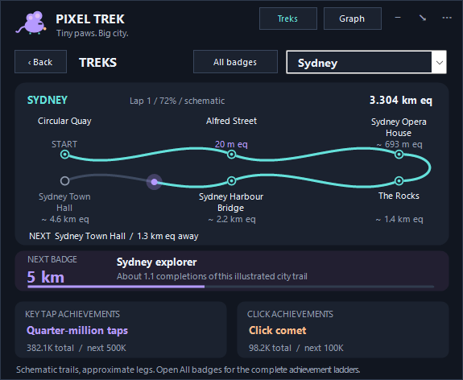
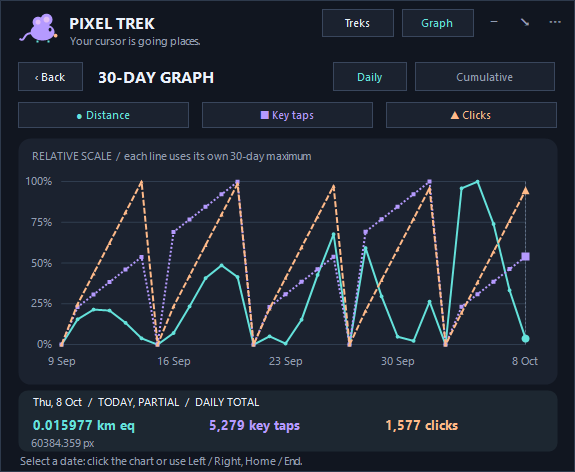

# Pixel Trek

**A little desktop adventure, one movement at a time.**

Pixel Trek is a native Windows cursor odometer. Its compact dashboard shows live speed and acceleration gauges, distance, physical key taps and mouse clicks. Explore five virtual city trails in **Treks**, or inspect your last 30 calendar days in **Graph**.

Windows 10/11 · C# / WinForms · .NET Framework 4.8 · MIT license

## Run the app

Download the portable ZIP from this repository's Releases, extract it, and open **PixelTrek.exe**. No installer, account, browser runtime or dependency download is needed. The executable is unsigned and requests no administrator elevation.

Quit the previous copy before replacing its app files. Saved odometer totals carry over. The source ZIP contains the buildable project; the portable ZIP contains the runnable app.

## Dashboard

Two custom instruments show cursor speed in **m/s equivalent** and acceleration in **m/s² equivalent**. Their numbers and needles use the same interpolated value. Dial saturation does not cap the numerical reading.

The visible dashboard requests a 30 ms refresh during motion or needle settling, then returns to a 250 ms timer with quiet paints limited to once per second. Measured motion samples wake an idle dashboard. Hidden, paused and minimized windows stop visual animation. Actual frame cadence depends on Windows timer scheduling and system load.

Today / Last hour / Lifetime changes the distance, key-tap and click cards. Canonical distance remains pixels. A slim celebration strip announces newly crossed milestones once; it does not replay historical achievements on startup, city selection or a screen-scale change.

## Treks

Click **Treks** to select New York, Sydney, London, Moscow or Paris. Each illustrated route has six named stops, a winding trail, traveller, next stop, lap percentage and distance badge progress. All badges opens the complete distance, key-tap and click achievement ladders.

| City | Illustrated stops |
|---|---|
| New York | Times Square → Broadway → Bryant Park → Grand Central Terminal → Empire State Building → Central Park |
| Sydney | Circular Quay → Alfred Street → Sydney Opera House → The Rocks → Sydney Harbour Bridge → Sydney Town Hall |
| London | Trafalgar Square → Whitehall → Big Ben → London Eye → St James's Park → Buckingham Palace |
| Moscow | Red Square → Nikolskaya Street → St Basil's Cathedral → Bolshoi Theatre → Gorky Park → Sparrow Hills |
| Paris | Louvre → Rue de Rivoli → Tuileries Garden → Place de la Concorde → Arc de Triomphe → Eiffel Tower |

Every city includes a playful 20 m street checkpoint. Later distances are approximate straight-line landmark legs. The curves are schematic, not road navigation or actual walking routes. City changes reuse the same lifetime totals. Completed routes begin another virtual lap. See [route notes](docs/TREKS.md).

## Graph

Graph displays 30 consecutive **local calendar dates**, including today. Missing dates are zero-filled and today is marked partial. The three lines show distance, physical key taps and mouse clicks.

The shared axis is a **relative 0–100% scale**: every series uses its own maximum within the displayed window. Unlike raw units are not mixed on a shared numerical axis. Distinct colours, line styles and markers identify the series; legend buttons hide or show each line.

Click the plot, or use Left / Right and Home / End, to choose a date. Exact selected counts and distance equivalents appear in the fixed detail strip, with the canonical pixel amount beneath. There are no floating chart tooltips.

**Daily** shows each date's totals. **Cumulative** shows running totals from zero at the start of the displayed window, separate from lifetime totals. Dates are snapshotted on entry; today's bucket refreshes at most once per second. Chart arrays contain only 30 points per series.

## Controls

| Control | Action |
|---|---|
| Treks / Graph | Open a complete secondary view inside the same window |
| Back / Escape | Return to Dashboard |
| Today / Last hour / Lifetime | Select the lower count cards |
| Drag the header | Move the widget |
| Minus | Collapse or expand the compact strip |
| Arrow | Hide to tray and keep counting |
| Double-click tray icon | Restore the widget |
| Three dots / right-click | Pause, screen scale, history, peaks, exports and settings |
| Quit & save | Save counts and stop tracking |

The main window stays **575 × 472 logical pixels**. Compact mode is **575 × 82**. Screen scaling changes physical display size.

## Measurement and privacy

Pixels measure the sum of observed cursor path segments on screen. Physical key-down transitions count once until release; held-key repeats are excluded. Click-down events count left, right, middle and extra buttons.

At 96 PPI, one million pixels is approximately 0.265 km equivalent. Converted distances and rates describe screen travel, not physical mouse travel. Changing PPI recalculates equivalents without changing saved pixels. Acceleration includes braking and direction changes. See [measurement notes](docs/MEASUREMENT.md).

No typed text, ordered key sequences, historical cursor positions, app/process names, calendar data or screen contents are collected. There are no network requests, analytics engines or third-party packages. [Privacy details](PRIVACY.md).

Data is stored at **%LOCALAPPDATA%\PixelTrek\counters.json**. Atomic saves run every ten seconds and on orderly quit, retaining a previous-save backup. Daily history keeps 366 active dates; lifetime totals remain separate. Last hour uses a sliding 60-minute window. A sudden interruption can lose activity since the last checkpoint.

## Build from source

On Windows with .NET Framework 4.8, open PowerShell in this repository and run:

~~~powershell
.\Build.ps1
~~~

The executable and runtime files appear in **dist**. The script uses the Windows .NET Framework C# compiler; no NuGet restore is needed. All required source files, manifest and configuration are included.

See [CONTRIBUTING.md](CONTRIBUTING.md) for isolated tests, native previews, smoke checks and the opt-in resource fixture. The included GitHub Actions workflow compiles, checks and packages the portable app on Windows.

## Verification

The current source passed **133 local checks** before packaging, covering input, persistence, motion, cities, Graph, milestones and rendering scales. See [test-results.txt](test-results.txt), [VERIFICATION.txt](VERIFICATION.txt) and [resource measurements](docs/RESOURCE-MEASUREMENTS.txt) for the exact results and limits. All screenshots use illustrative data. GitHub CI has not run until it runs in your repository.

## Credits and license

Created by **Nav Medikonda**, developed with AI assistance from **OpenAI Codex**. The mascot and icon are drawn by the application's code. See [CREDITS.md](CREDITS.md). Released under the [MIT license](LICENSE).
