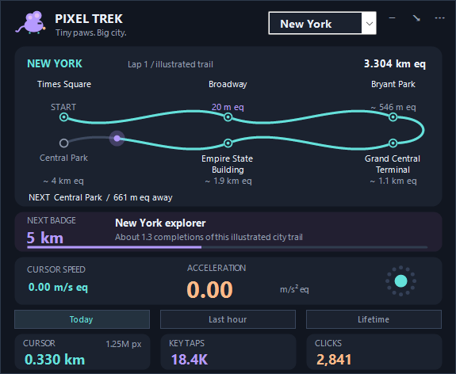

# Pixel Trek

**A tiny native Windows odometer for your cursor, with a live acceleration gauge.**

Count your desktop pixels, key presses and clicks. Watch cursor speed and acceleration. Keep the widget in the corner, collapse it to a slim strip, or hide it in the tray.



*Preview uses example totals. Kilometres and motion rates are screen equivalents at a configurable pixel density.*

## What makes it interesting

- **Cursor physics:** smoothed speed and two-dimensional acceleration, including braking and changes of direction. A small native gauge responds to your movement.
- **Three time windows:** today, rolling last 60 minutes and lifetime distance/counts. Peak speed and acceleration use the same windows.
- **Transparent units:** raw pixels alongside km equivalents. Use a 96 PPI reference or calculate a screen scale from your monitor dimensions.
- **A little adventure:** explorer mascot, pixel checkpoints, milestones and best-day records.
- **Local history you own:** daily CSV export, JSON backup and shareable PNG recap generated on request.
- **Small native UI:** C# / WinForms / GDI+. No Electron, browser engine, embedded web view, third-party NuGet packages or large asset bundles.
- **Private by construction:** aggregate counts only. No typed text, stored key sequences, cursor trails, app names or background network calls.

This is a deliberately narrow Windows utility. It makes everyday desktop activity visible without adding a full dashboard or an account system.

## Run

Download the portable Windows ZIP from this repository's Releases after a release is published. Extract the whole folder and open `PixelTrek.exe`.

Uses .NET Framework 4.8, included in standard Windows 10/11 installations. No installer or administrator access is requested. The current executable is unsigned; Windows and workplace security policies may warn or block it.

Right-click the widget or use the three-dot menu. Double-click the tray icon to restore it. Startup at sign-in is optional and off initially.

**Update:** quit the old app, replace its executable/configuration files and reopen. Existing v0.1 totals are preserved. New peak-rate records begin when you run v0.2.

## Why "km equivalent"?

A screen pixel is a coordinate unit, not a fixed physical length. Pixel Trek stores pixels and uses a selected scale for familiar units:

```text
metres equivalent = pixels × 0.0254 / pixels_per_inch
kilometres equivalent = metres equivalent / 1000
```

At the default **96 PPI reference**, 1,000,000 pixels equals approximately **0.265 km equivalent**. This is a declared convention, not automatic measurement of your display. One factor applies across all monitors and saved history. Changing it recomputes displayed equivalents while retaining pixel totals.

Acceleration is sampled from changes in cursor velocity, not from the operating system's mouse-acceleration setting. See [the measurement notes](docs/MEASUREMENT.md) for the sampling and smoothing formulas.

## Build and verify

From PowerShell in the extracted source directory:

```powershell
.\Build.ps1
.\dist\PixelTrek.exe --self-test C:\Temp\PixelTrek-checks
```

The build uses the C# compiler supplied with Windows .NET Framework. It needs no SDK or NuGet restore. Test output is written to `test-results.txt` in the selected scratch directory; the process exits with 0 on success. [CONTRIBUTING.md](CONTRIBUTING.md) includes UI preview and smoke-check commands.

The release's verification report separates automated checks from physical-device and multi-monitor testing. Resource figures are measurements from a specific environment, not universal guarantees.

## Saved data

Data is in `%LOCALAPPDATA%\PixelTrek`, separate from the executable. Save checkpoints occur every ten seconds, with a previous-save backup and recovery. Daily history is bounded to 366 active dates; lifetime totals and peaks are retained independently.

No cloud services are used. [PRIVACY.md](PRIVACY.md) describes what is briefly held in memory and what is persisted.

## Contribute

Useful contributions include physical-device compatibility reports, mixed-DPI testing, input-path performance measurements, accessibility improvements and measurement corrections. See [CONTRIBUTING.md](CONTRIBUTING.md). Please describe the environment and how to reproduce the result rather than posting private activity data.

If the app helps you, a star makes it easier to find again. Bugs and thoughtful contributions are equally welcome.

## Authorship and license

Created by **Nav Medikonda**, with AI-assisted implementation using OpenAI Codex. Product direction, review, release decisions and maintenance are human responsibilities. See [CREDITS.md](CREDITS.md).

MIT licensed. See [LICENSE](LICENSE).
