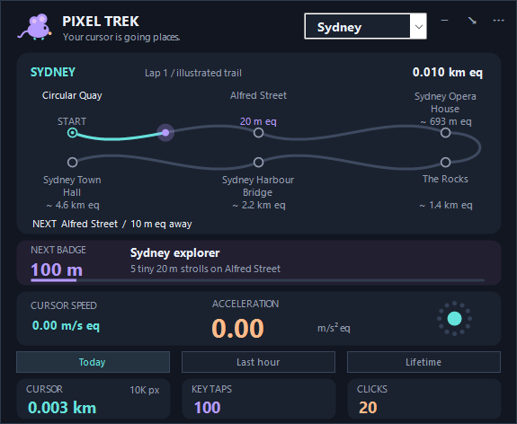

# 🐭 Pixel Trek

**Five cities. One curious mouse. Every little move adds up.**

A small native Windows widget that turns your cursor's screen travel into an illustrated city adventure. Follow landmarks, collect distance badges, and see how many pixels, key taps and clicks your day contains.


**Windows 10/11 · Native C# / WinForms · Portable ZIP · MIT license**

[Features](#features) · [Download and run](#download-and-run) · [Cities](#choose-your-city) · [Build](#build-from-source) · [Contribute](CONTRIBUTING.md)

## Download and run

1. Open this repository's **Releases** section.
2. Download **`PixelTrek-v0.3.1-Portable.zip`** from the release assets.
3. Extract the ZIP and open **`PixelTrek.exe`**.

No installer, account or browser runtime is needed. Requires **.NET Framework 4.8** on Windows.

To update, quit the previous copy before replacing its app files. Your existing odometer totals carry over. GitHub's automatically generated **Source code** downloads contain the project files; choose the **Portable** asset to run the app directly.

The executable is unsigned, so Windows or workplace security settings may warn or block it. The app requests no administrator elevation.

## Features

| Feature | What you get |
|---|---|
| City treks | Five cities, six labelled stops each, winding trails and a traveller dot |
| Tiny first steps | A playful 20 m street checkpoint in every city |
| Cursor odometer | Pixels and kilometre equivalents for Today, Last hour and Lifetime |
| Taps and clicks | Physical key-tap and mouse-click counts for the same periods |
| Cursor physics | Live speed, acceleration and saved motion peaks |
| Distance badges | Ten tiers from 100 m to 100 km, with city-themed home cards |
| Input achievements | Eleven key-tap tiers and eleven click tiers |
| Mouse mascot | Exploring while input is active; resting when idle |
| Small native UI | One home screen, a compact strip and a tray icon |
| Local exports | Daily CSV, counters backup and a shareable recap PNG |

The home window is **575 × 472 logical pixels**; compact mode is **575 × 82**.

## Choose your city

Pick a city from the native dropdown. **New York is the default.** Every node has a place name, and the next stop shows your remaining distance equivalent.

| City | Your illustrated trail |
|---|---|
| [New York](assets/new-york.png) | Times Square → Broadway → Bryant Park → Grand Central Terminal → Empire State Building → Central Park |
| [Sydney](assets/sydney.png) | Circular Quay → Alfred Street → Sydney Opera House → The Rocks → Sydney Harbour Bridge → Sydney Town Hall |
| [London](assets/london.png) | Trafalgar Square → Whitehall → Big Ben → London Eye → St James's Park → Buckingham Palace |
| [Moscow](assets/moscow.png) | Red Square → Nikolskaya Street → St Basil's Cathedral → Bolshoi Theatre → Gorky Park → Sparrow Hills |
| [Paris](assets/paris.png) | Louvre → Rue de Rivoli → Tuileries Garden → Place de la Concorde → Arc de Triomphe → Eiffel Tower |

City changes reuse your lifetime distance without resetting counts. Finish a trail and your mouse starts another virtual lap.

The street stop is a playful **20 m equivalent checkpoint** near the origin. Later stops use cumulative straight-line geographic legs between approximate landmark anchors. The curves and node spacing are illustrations; they are not street navigation or measured walking routes. See [route notes and references](docs/TREKS.md).

## Collect little victories

Distance badges unlock at **100 m, 500 m, 1 km, 2 km, 5 km, 8 km, 10 km, 15 km, 50 km and 100 km equivalents**. The home badge card changes with your city and shows progress toward the next tier.

Your first tiny street adventure:



Open **History, peaks & achievements** for daily totals, motion records and the full key-tap/click achievement ladders.

## Controls

| Control | Action |
|---|---|
| City dropdown | Choose your illustrated destination |
| Today / Last hour / Lifetime | Change the three count cards |
| Drag the header | Move the widget |
| Minus button | Collapse or expand |
| Arrow button | Hide to the tray and keep counting |
| Double-click the tray icon | Restore the widget |
| Three dots or right-click | Pause, scale, history, exports and other controls |
| Quit & save | Save your totals and stop tracking |

## What the units mean

Pixels are the canonical measurement. Converted units describe cursor travel **on screen** at your selected pixels-per-inch reference:

```text
km equivalent   = pixels × 0.0254 / PPI / 1000
m/s equivalent  = pixels per second × 0.0254 / PPI
m/s² equivalent = pixels per second squared × 0.0254 / PPI
```

At the default **96 PPI**, one million pixels is approximately **0.265 km equivalent**. This does not measure physical mouse or trackpad travel. Changing screen scale recalculates the equivalents without changing saved pixels. One scale applies across monitors and history.

Acceleration is the smoothed magnitude of changes in cursor velocity, including braking and turns. See [measurement details](docs/MEASUREMENT.md).

## Local counts and saved progress

Pixel Trek saves aggregate counts, motion peaks and ordinary preferences locally. It does not collect typed text, ordered key sequences, app/process names, calendar data, screen contents or exact cursor trails. This Trek edition contains no workflow, focus or strain analytics engine. There are no network requests or third-party packages.

Your data is stored at:

```text
%LOCALAPPDATA%\PixelTrek\counters.json
```

Atomic checkpoints run every ten seconds and on orderly quit, with a previous-save backup. Daily history retains **366 active dates**; lifetime totals remain separate. Last hour is a sliding 60-minute window. A sudden interruption can lose activity since the latest successful checkpoint.

Older v0.3.0 insight files are left untouched and never loaded by this edition. Read [PRIVACY.md](PRIVACY.md) for the complete storage description.

## Build from source

On Windows with .NET Framework 4.8, open PowerShell in the project folder:

```powershell
.\Build.ps1
```

The executable and portable runtime files appear in **`dist`**. No package restore or dependency downloads are required.

Run the checks in a new scratch directory:

```powershell
$checkDir = Join-Path $env:TEMP ('PixelTrek-checks-' + [Guid]::NewGuid().ToString('N'))
$run = Start-Process -FilePath '.\dist\PixelTrek.exe' `
    -ArgumentList '--self-test', ('"' + $checkDir + '"') `
    -WindowStyle Hidden -Wait -PassThru
Get-Content (Join-Path $checkDir 'test-results.txt')
if ($run.ExitCode -ne 0) { throw 'Pixel Trek checks failed.' }
```

Preview and native smoke commands are documented in [CONTRIBUTING.md](CONTRIBUTING.md).

## Verification

The **0.3.1 build passed 109 local checks**, including input counts, persistence, older-save migration, motion formulas, display-scale rendering, city selection and repeated virtual laps. Native previews were inspected for all five cities, and a 25-second startup/save run completed successfully.

That short run sampled **48.4 MiB working-set memory**. It is an observation, not a memory ceiling or long-term benchmark. Physical-device coverage, real mixed-DPI monitors and long-term use need further testing. The GitHub CI workflow is included; no successful GitHub run is claimed before it runs on this repository.

See [VERIFICATION.txt](VERIFICATION.txt) and [test-results.txt](test-results.txt). All preview images use illustrative data.

## Contribute

Bug reports, hardware testing, clearer route references and improvements to accessibility or display scaling are welcome. Include reproduction steps and your Windows/display setup when reporting a problem.

Start with [CONTRIBUTING.md](CONTRIBUTING.md). Keep the widget native, preserve existing totals and keep input callbacks short.

## Credits and license

Created by **Nav Medikonda**, developed with AI assistance from **OpenAI Codex**. The mascot and icon are drawn by the application's code. See [CREDITS.md](CREDITS.md).

Released under the **[MIT license](LICENSE)**.
